<div align="center">



<br/>

<a href="https://git.io/typing-svg">
  
</a>

<br/>

[](https://www.linkedin.com/in/ziad-elalaily-195a44140/)
[](https://github.com/Ziad-ElAlaily)


</div>

---

## `> whoami`

```yaml
name: Ziad El-Alaily
role: AI Engineering Practice Lead
base: Cairo, Egypt

mission:
  - Turn ambitious AI opportunities into production-grade systems
  - Build reusable AI capabilities that scale across teams and clients
  - Raise the engineering bar for enterprise AI delivery

operating_mode:
  - Business strategy
  - Solution architecture
  - Hands-on engineering
  - Technical leadership
  - Client and stakeholder management

languages:
  - Arabic
  - English
  - German
  - French
```

<div align="center">

### ⚡ I can propose it, win it, architect it, lead it, and deliver it.

</div>

---

## 🧠 AI Command Center

<table>
<tr>
<td width="25%" align="center">

### 🤖  
**Agentic AI**

Multi-agent systems  
AI assistants  
Tool orchestration  
Memory and planning  

</td>
<td width="25%" align="center">

### 🧬  
**Generative AI**

Enterprise RAG  
LLM evaluation  
Guardrails  
Private AI  

</td>
<td width="25%" align="center">

### 🏗️  
**AI Platforms**

Reusable accelerators  
Scalable pipelines  
MLOps and LLMOps  
Observability  

</td>
<td width="25%" align="center">

### 🧭  
**Leadership**

Practice strategy  
Team building  
Client advisory  
Delivery excellence  

</td>
</tr>
</table>

---

## ⚔️ Technology Arsenal

<div align="center">

### Core Engineering


### AI, Data & Cloud


### Delivery & Tooling


<br/>


</div>

---

## 🚀 Mission Modules

<table>
<tr>
<td width="50%" valign="top">

### `01 // Enterprise AI Accelerators`

Reusable foundations that help teams move from disconnected prototypes to governed, repeatable, production-ready AI delivery.

`AI platforms` · `evaluation` · `guardrails` · `observability`

</td>
<td width="50%" valign="top">

### `02 // Intelligent Time-Series Systems`

Hybrid deep-learning and machine-learning systems with advanced feature engineering, residual correction, chronological validation, and automated reporting.

`LSTM` · `XGBoost` · `time series` · `model validation`

</td>
</tr>
<tr>
<td width="50%" valign="top">

### `03 // Digital Knowledge Systems`

Platforms that transform professional experience, documents, and career knowledge into searchable, interactive expert intelligence.

`knowledge graphs` · `RAG` · `expert systems` · `LLMs`

</td>
<td width="50%" valign="top">

### `04 // Adaptive AI Assistants`

Context-aware conversational systems built around memory, personalization, privacy, evaluation, and long-term usefulness.

`memory` · `agents` · `personalization` · `responsible AI`

</td>
</tr>
</table>

---

## 🛰️ Selected Public Work

<table>
<tr>
<td width="50%" valign="top">

### 🖐️ [Sign-Language Gesture Recognition](https://github.com/Ziad-ElAlaily/sign-language-gesture-recognition)

Video-sequence gesture recognition using CNN and RNN architectures.

[](https://github.com/Ziad-ElAlaily/sign-language-gesture-recognition)

</td>
<td width="50%" valign="top">

### 📄 [Resume Parser](https://github.com/Ziad-ElAlaily/resume-parser)

A Node.js parser for extracting structured data from CV and résumé formats.

[](https://github.com/Ziad-ElAlaily/resume-parser)

</td>
</tr>
<tr>
<td width="50%" valign="top">

### 🧪 [Machine Learning Nanodegree](https://github.com/Ziad-ElAlaily/Machine-Learning-Nanodegree)

Applied machine-learning coursework, experiments, and project implementations.

[](https://github.com/Ziad-ElAlaily/Machine-Learning-Nanodegree)

</td>
<td width="50%" valign="top">

### 🌐 [Portfolio](https://github.com/Ziad-ElAlaily/Portofolio)

An earlier portfolio project showcasing web-development and front-end work.

[](https://github.com/Ziad-ElAlaily/Portofolio)

</td>
</tr>
</table>

> Most of my recent enterprise AI work is confidential. Public repositories here represent selected experiments, research, and earlier engineering work.

---

## 🏆 Achievement Grid

<div align="center">


</div>

---

## 📊 System Telemetry

<div align="center">


<br/>


<br/>


</div>

---

## 🐍 Contribution Stream

<div align="center">


</div>

---

## 🎯 Current Objectives

```text
[ ACTIVE ] Building reusable enterprise AI capabilities
[ ACTIVE ] Designing scalable agentic systems
[ ACTIVE ] Raising engineering quality across AI delivery
[ ACTIVE ] Turning technical innovation into measurable business value
```

---

<div align="center">


### `FROM OPPORTUNITY → ARCHITECTURE → IMPACT`

[](https://www.linkedin.com/in/ziad-elalaily-195a44140/)

</div>
